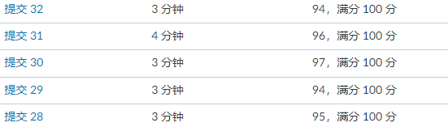
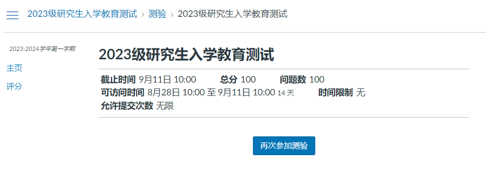
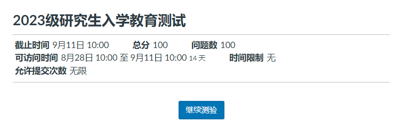
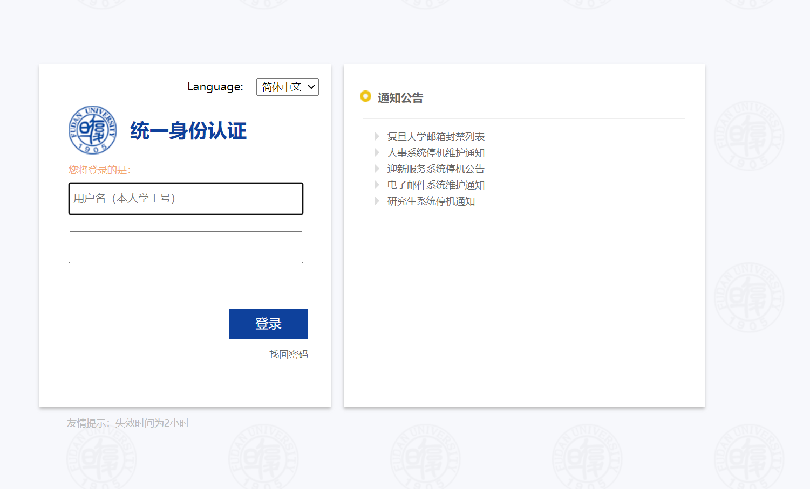

# FreshmanTest

本项目为复旦大学入学教育测试自动答题脚本，旨在帮助大家度过一个更加轻松的开学季。

主要内容源于去年的学长的代码: 

## 成果
本项目的目标是尽可能地操作方便，以让更多的同学能够使用。

基本上能够稳上90分，如果未来因为题库更新的原因正确率下降，可以自行通过本项目自带的更新
题库功能，来提高准确率。



## 环境配置
### selenium
可以自行去网上搜索下载方案，比如
https://blog.csdn.net/qq_48736958/article/details/115179198

其中下载selenium时请使用
```text
pip install selenium==3.14.0
```
### 其他依赖
```text
selenium==3.14.0
json
os
time
typing
```
### 环境变量

本项目的环境变量在`environment.py`中,请填入自己的driver_path,且如果打不开

```python
driver_path = "your/webdriver/path"
# default
auth_url = "https://uis.fudan.edu.cn/authserver/login"
main_page = r"https://elearning.fudan.edu.cn/courses/77197/quizzes/11131"

cookie_path = 'asset/cookies.txt'
question_path = "asset/questions.json"

if_load_cookie = False
if_add_question = True

input_wait_time = 20
```
- driver_path: 如果你在安装selenium时，把webdriver放在了python的目录底下，就可以把这行注释掉了。
否则，要填入你的webdriver的路径。
- auth_url: 复旦验证服务器的url。
- main_page: 测试界面的url，测试界面如下图所示。

- cookie_path: 保存cookie的位置（不上传到github）
- question_path: 保存题库的位置（上传）
- if_load_cookie: 是否每次启动要加载一次cookie（为True则要重新加载）
  - 默认情况如果加载过cookie，则之后启动不再需要cookie
  - 当你很久未使用本项目（cookie失效），要么删除cookie.txt，要么将这个变量设置为True
- if_add_question: 每次更新是覆盖还是增加（为True则增加）
- input_wait_time: 输入密码的时间(s)

## 运行
因为存在多选题，所以你在运行程序之前必须把未完成的测试提交了

这样是错误的



而这样是正确的


在项目文件夹打开terminal，输入以下命令
```text
python main.py
```
**登录以获得Cookie**

在这个界面你默认将会有20s的时间来输入你的账号密码，由于本项目只会获得cookie，只要你不把你的cookie传到网上，则没有安全问题


接下来就不需要你操作了，脚本会自动执行。

### 扩充题库
为了以防未来题库扩充，或者题库数据被污染，所以本项目带有扩充题库功能。

如果你需要删除以前的题库，则将`environment.py`中的`if_add_question`设置为False
```python
if_add_question = False
```
并执行以下命令，否则则将`if_add_question`设置为True，此时，题库将会增长而不覆盖。
```text
python load_question.py
```

